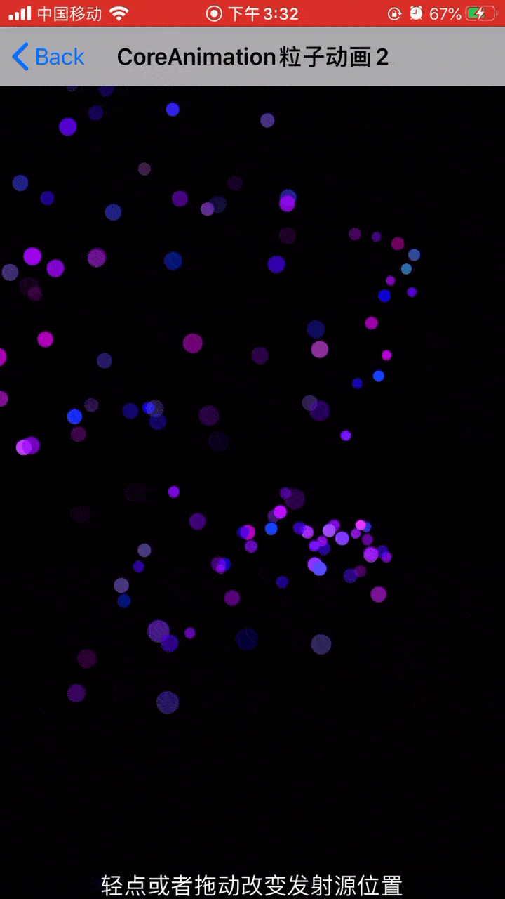
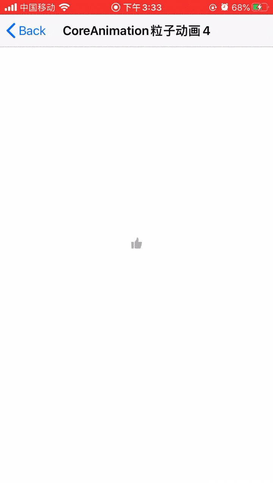

# Visual Animation
    
    
## 一、粒子特效
1. 粒子特效1
    
2. 粒子特效2
    
3. 粒子特效3
    
4. 粒子特效4
    

-------

## 二、OPenGL ES 滤镜特效

1. GLSL加载图片
2. GLSL三角形变换
3. 滤镜效果
    1. OpenGL ES 原图加载 (splitScreen_normal)
    2. 分屏滤镜 (splitScreen_2/3/4/6/9)
    3. 灰度滤镜 (gray)
    4. 翻转滤镜 (reversal)
    5. 马赛克:方形 (mosaic_square)
    6. 马赛克:六边形 (mosaic_hexagon)
    7. 马赛克:三角形 (mosaic_triangle)
    8. 缩放滤镜 (scale)
    9. 灵魂出窍滤镜 (soul)
    10. 抖动滤镜 (shake)
    11. 闪白滤镜 (shakeWhite)
    12. 毛刺滤镜 (glitch)
    13. 幻觉滤镜 (vertigos)
4. 长腿滤镜
5. GPUImage静态图片-饱和度滤镜
6. GPUImage拍照-灰度滤镜
7. GPUImage视频录制-饱和度滤镜

GLSL注释文件 : /OpenGL-ES/GLSL/OpenGL滤镜/GLSL注释讲解.md  

-------

## 三、Metal
1. Hello Metal 初始
2. Metal实现三角形
3. Metal加载TGA/JPG图片
4. Metal视频采集&渲染
